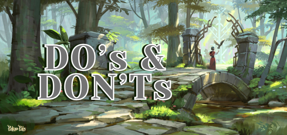

# Do's and Don'ts

Every great event thrives on **respect, fun, and community spirit**.  
Whether in voice chat, text, or in-game, these guidelines keep our events safe, smooth, and enjoyable for everyone.

 

---

## ✅ DO’s

- **Respect Others 💃🕺** – Be kind, polite, and respect personal boundaries.  
- **Keep It Fun 🍹** – Share jokes and memes without spamming or derailing chats.  
- **Follow Music Rules 🎶** – Respect the queue, don’t skip songs, and manage your own volume.  
- **Stay Friendly 🌈** – No offensive jokes or toxic behavior; keep it light and safe.  
- **Listen to Hosts 🕶️** – Follow staff guidance to ensure smooth flow of events.  
- **Be Courteous in Voice Chat 🎤** – Check your mic, avoid loud noises, and give others a chance to talk. Be patient and wait for your turn to speak.  
- **Include Everyone 💌** – Respect pronouns, identities, and ensure no discrimination.  
- **Use Spoiler Tags 🚫📖** – Tag storyline or quest details properly. Do not spoil the fun for newbies and those who want to explore on their own.  
- **Communicate Clearly 🗣️** – Use English as primary language, avoid caps lock and unreadable text.  
- **Protect Privacy 🔒** – Don’t DM staff unless urgent, and never share personal info or private chats.  
- **Report Issues 🚨** – Report rule-breaking to staff instead of confronting directly. You can send a ticket to be handled by the staff.  

---

## ❌ DON’Ts

- **Disrespect or Harass** – No bullying, drama, hate speech, or harassment of any kind.  
- **Spam or Flood Chats** – No spamming messages, emojis, or constantly derailing conversations.  
- **Disrupt Music 🎶** – Don’t skip, interrupt, or cut into the queue.  
- **Break the Safe Atmosphere 🌈** – No NSFW content, offensive jokes, or toxic behavior.  
- **Challenge Hosts in Public 🕶️** – Don’t argue or cause drama in chat; send a ticket for support.  
- **Cause Chaos in Voice 🎤** – No screaming, earrape, blasting soundboards, or constant interruptions.  
- **Stream Without Permission 📺** – No live streaming during events unless approved.  
- **Ignore Staff Directions** – Disrupting or ignoring instructions may lead to strikes.  
- **Leak or Violate Privacy 🔒** – No sharing personal info, DMs, screenshots, or conversations without consent.  
- **Escalate Conflicts 🚨** – Don’t argue with offenders; always report instead.  

---

## ⏰✨ Attendance Issues

- Don’t RSVP and then no-show without notice.  
- Don’t RSVP and stay silent if you can’t attend — inform the host.  
- Don’t arrive late without informing as it disrupts the flow of event.  
- Don’t leave early without telling the host — it complicates coordination.  
- Don’t cancel at the last minute unless necessary — notify ASAP so spots can be filled.  
- Don’t bring friends on the spot — we strictly **DO NOT ALLOW** unregistered show-ups to be fair to those who signed up first.  
