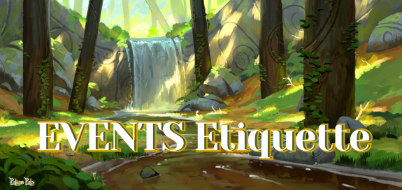

# Events Etiquette

Welcome, Pals! 🥳 
Our events are all about creating cozy, memorable experiences together. 

To ensure everyone feels comfortable and has a good time, we’ve compiled some simple etiquette guidelines. 

Think of these not as strict rules, but as a shared understanding to help keep our gatherings smooth, inclusive, and enjoyable for all. ✨,

  

---

## 1. Respect the Party People 💃🕺
Respect is the heart of every good party.
 - Be kind, courteous, and considerate of others.
 - Disagreements may happen, but no drama, bullying, hate speech, or harassment of any kind will ever be tolerated.
 - Respect personal boundaries — if someone says “no,” listen and move on.

Keep in mind that behind every username is a real person who deserves kindness.
✨ **Remember: we’re all here to have fun, make friends, and share good vibes.**

---
 
## 2. Keep It Fun, Not Messy 🍹
We love a lively, energetic party — but let’s keep it enjoyable for everyone.
 - Jokes, memes, and playful chatter are encouraged! 🎭
 - Avoid spamming messages, flooding the chat, or constantly derailing conversations.
 - Allow space for others to share their thoughts too.

Think of the chat like a dance floor, it’s fun when everyone has room to move, not when one person takes up the whole space. 

---

## 3. Music  🎶
Our party channels are here to keep the fun flowing!
 - If we’re using a **music bot, follow the queue system** — don’t skip ahead of others or interrupt ongoing songs.
 - You can **deafen, minimize or maximize the volume of the bot**, don't spoil the fun for others.
 - Respect the flow of the activity — no cutting in and interrupting.

**Remember: it’s all about sharing the experience together, not taking over.**

---

## 4. Safe & Friendly Atmosphere 🌈
This community is a safe haven for everyone.
 - Absolutely no NSFW content, explicit material, or excessive swearing.
 - Keep conversations lighthearted and fun. Avoid offensive jokes, toxic behavior, or anything that might make others uncomfortable.
 - Think before you post: “Is this something I’d want others to see at a public gathering?”

We want this to be a place where everyone feels welcome, no matter their background.

---

## 5. Party / Event Hosts 🕶️
Think of our staff as the party hosts keeping the vibe alive.
 - Please listen to their guidance and respect their decisions.
 - If you feel that the host made a mistake or you need clarification, reach out privately instead of starting drama in chat.

Their job is to make sure the party stays safe, organized, and fun for all, so let’s work with them, not against them. 

---

## 6. Voice Channel Etiquette 🎤
Voice chat makes the party more immersive, but let’s keep it smooth and friendly.
 - No earrape, screaming, blasting loud music, or disruptive soundboards.
 - Be mindful of your mic settings — background noise and echo can be distracting.
 - Give everyone a chance to speak and don’t constantly talk over others.
 - Follow the specific rules of music when it is active.

**If you’re shy, it’s okay to stay muted — just being present in VC helps you stay connected to the group.**

---

## 7. No Live Streamings or Content Creation 📺🚫
To keep our events comfortable and safe for everyone, live streaming during events is **stricly not allowed without permission from the staff or event host.**
 - Events are meant to be shared within the community, not broadcasted elsewhere.
 - **Streaming without consent** may make others feel uncomfortable or exposed.
 - If you’d like to share moments, take screenshots or short clips instead — just make sure they’re appropriate and respectful before posting. **Hide the names of the players** for privacy.

---

## 8. Keep the Party Inclusive 💌
Our community thrives when everyone feels welcome.
 - Always respect pronouns, identities, and personal boundaries.
 - No discrimination of any kind — everyone deserves to feel valued here.
 - Treat others the way you’d like to be treated, both in chat and in games.

Inclusivity is what makes our community feels like home ✨

---

## 9. Have Fun & Make Memories 📸
Above all else, **enjoy yourself!**
 - Laugh, play, and create moments worth remembering.
 - Be silly, share your stories, and celebrate together.
 - Whether you’re here to make new friends, relax after a long day, or join the fun, this is your space to shine.

**Let’s make every party unforgettable, one memory at a time!**  🥰 💚
