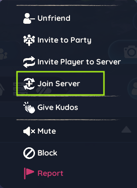
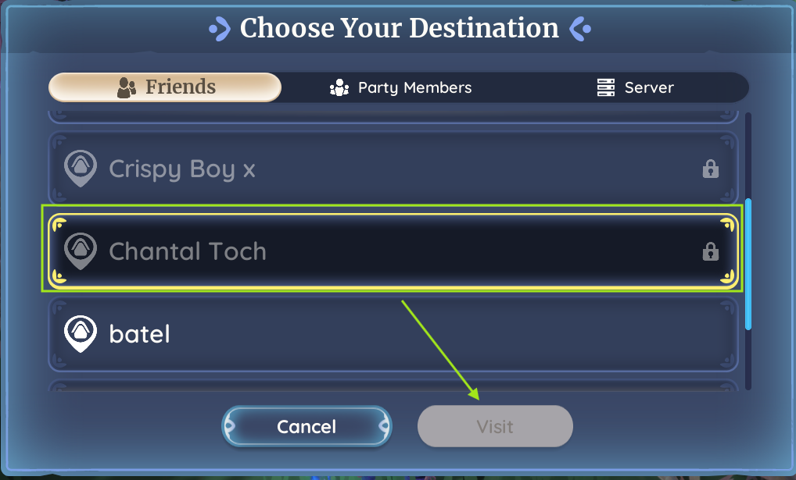

# Home Plot Syncing

This tutorial will guide you through **to the home plot of the host** in Palia.  
Syncing ensures your on the same server and allows you to **join shared events, co-op activities**,

---

## Step 1: Prepare Yourself

Before joining, make sure you have **all the items and tools required for the event**:  

- 🏹 Arrows, bags, worms, or other requirements
- 🧰 Tools needed for crafting, gathering, or event tasks  
- 🎒 Sufficient inventory space for rewards and loot  
- 🍎 Food, potions, or consumables required for the activity  

> 💡 Tip: Check the event announcement or host instructions — being properly prepared ensures you don’t miss out on fun activities or important rewards.

---

## Step 2: Add the host in friend list

1. Open your **Friends List** in-game.  
2. Search for the **host’s username** and send a friend request.  
3. Wait until the host accepts your friend request.  

> 💡 Tip: You must be friends with the host to join their home plot unless they put their plot on public.

---

## Step 2b: Sync server with host (Optional)

> 💡 Tip: Sometimes the host will ask you to sync upfront, in order to avoid a full server.
1. Open your **Friends List**, find the host, and click the **three dots** next to their name.  
2. Select **Join Server**.  
3. Wait for the sync to complete before taking any in-game actions.  

:::caution

Do not log out during syncing to prevent errors.

:::
---

  
  

---

## Step 3: Travel to host home plot

1. Wait until u receive a message from the host that the plot is open. (Event discord channel)
1. Make sure you are on ur home plot.
2. Move to the Visiting Board.
3. Under friends search for the **host’s username**.

---

  
  

---

✅ You are now synced!  
You can fully participate in shared events, co-op activities, and community adventures with the host.
