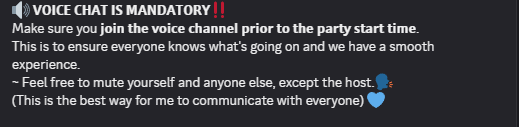
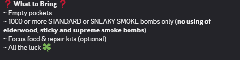
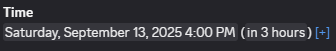
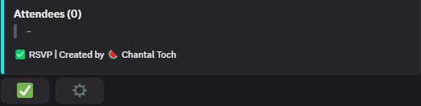
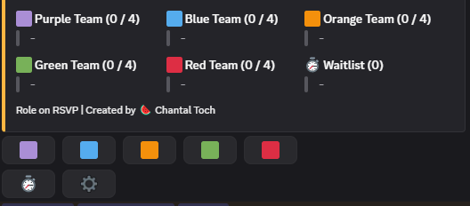
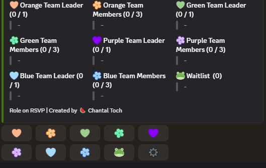
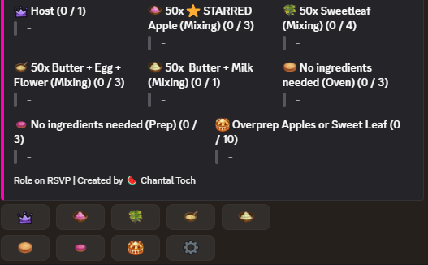

# Join an event

This guide will show you how to **join a community event** in Palian Pals.  
Following these steps ensures you are prepared and can participate smoothly in shared activities with other players.

---

## Step 1: Check Event Details

- Open the **Discord server** and navigate to the channel corresponding to the day of the event.  
- Look at the **event announcement** for date, time, and requirements.  
- Make sure you have **all items, tools, and consumables** needed for the event.  
- Confirm the **host or organizer’s username**.

> 💡 Tip: Date and time will always be in ur local time. The time written is how late the event will start.

---

**Voice Chat**

 

**Requirement example:**

 

**Date example**

 

---

## Step 2: RSVP (Sign up for the event)

We make use of **Sesh** for event sign-ups:  

1. Open the **Discord server** and navigate to the channel corresponding to the day of the event.  
2. Click **ONE of the roles** to sign up for the event (this can be a team or a ingredient in case of cooking events).  
3. Make sure your RSVP is confirmed — you may receive a notification or confirmation message.  

> ⚠️ Note: Some events have limited spots — RSVP early to secure your place to avoid been waitlisted!

:::tip Waitlist

If the selected role is full, you will be placed on a **waitlist** in the order you signed up.  
If someone does not show, we will contact you to join the event based on your position on the list. 
This ensures fairness for everyone. 

**Do NOT sync unless the host tells you to sync.** 

:::

---
**No Role Example:**

 

**Team Role Example:**

 

**Team Role with leader Example**

(leader will just add everyone in a party, but is not required to voice chat)

 

**Cooking Role Example:**

 

---

## Step 3: Add the Host or Organizer

1. Open your **Friends List** in-game.  
2. Search for the **host’s username** and send a friend request.  
3. Wait for them to accept your request.  

> 💡 Tip: You need to be friends with the host to join most events.

---
