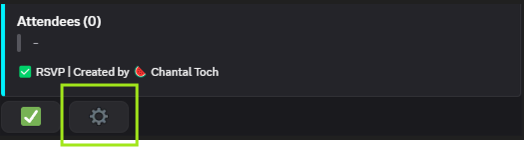
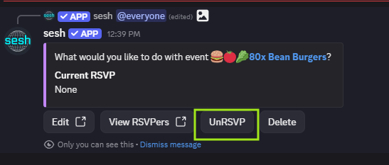
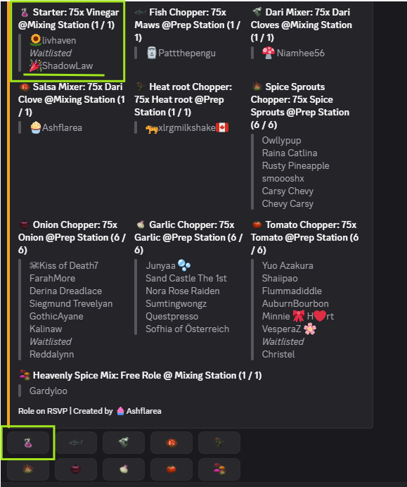

# Leave an event

This guide will show you how to **leave a community event** in Palian Pals.  
Following these steps ensures you are **respectful to the host and organizers** and helps the event run smoothly.

---

## Step 1: Cancel your RSVP (Unsign for an Event)

- Open the **Discord server** and navigate to the channel corresponding to the day of the event.
- If you RSVP’d via **Sesh**, remove your RSVP to free up your spot for others.

(This can be done in two way, more information in the images below)

---

**Method 1**

 

 

**Method 2**

 

---

## Step 2: Notify the Host

1. Open the **Discord server** where the event is being hosted.  
2. Post in the event channel to let the host know you cannot attend.  

> 💡 Tip: Early notice is always appreciated, especially if your spot could be given to someone on the waitlist.

---
