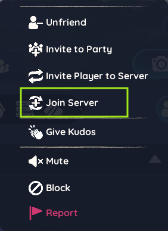

# Syncing

This tutorial will guide you through **syncing to the host** in Palia.  
Syncing ensures your on the same server and allows you to **join shared events, co-op activities**,

---

## Step 1: Prepare Yourself

Before joining, make sure you have **all the items and tools required for the event**:  

- 🏹 Arrows, bags, worms, or other requirements
- 🧰 Tools needed for crafting, gathering, or event tasks  
- 🎒 Sufficient inventory space for rewards and loot  
- 🍎 Food, potions, or consumables required for the activity  

> 💡 Tip: Check the event announcement or host instructions — being properly prepared ensures you don’t miss out on fun activities or important rewards.

---

## Step 2: Add the host in friend list

1. Open your **Friends List** in-game.  
2. Search for the **host’s username** and send a friend request.  
3. Wait until the host accepts your friend request.  

> 💡 Tip: You must be friends with the host to join their server directly.

---

## Step 3: Join the Same Map
 
Get to the **map where the event will take place**.  

---

## Step 4: Sync server with host

1. Wait until the host tells you to sync.  
2. Open your **Friends List**, find the host, and click the **three dots** next to their name.  
3. Select **Join Server**.  
4. Wait for the sync to complete before taking any in-game actions.  

:::caution

Do not log out during syncing to prevent errors.

:::
---

  
  

---

✅ You are now synced!  
You can fully participate in shared events, co-op activities, and community adventures with the host.
