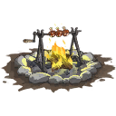
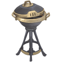
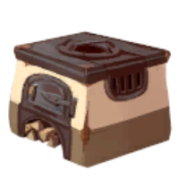
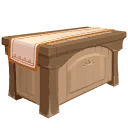
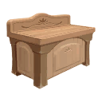
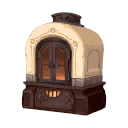

# Cooking Stations Explained

Below are the six cooking stations the game has.

To cook ALL recipes available you will need 2 stations of each in your house.
Some recipes are started at the same station that you also need for your ingredients. 
So, for example, some dishes started on a stove, like Chili Oil Dumpings, also need rice to be cooked on a stove. 
You'd need a second stove to cook the rice on.

| Image | Name | Usage | How to Obtain  | 
|:-----:|------|--------|-------------|
|| Campfire | Only used for smaller dishes that have 1 ingredient and cannot be cooked together. This is also where you make the **Fisherman's Brew** to help with your fishing adventures. | Craftable at your Workstation:   5 Sapwood - 10 Stone - 2 Flint - 10 Plant Fiber |
|| Grill Master v3000 | Just an upgrade for the Campfire above, it can cook the same recipes. It is however a one of a kind quest item. | **The GrillMaster** is obtained by the Player during the quest **It Must Flow** and cannot be crafted. **It Must Flow** is a **Found Item Quest** started by interacting with an empty spice rack in the kitchen of Hodari and Najuma's House. |
|| Stove | 
|| Mixing Station | 
|| Prep Station | 
|| Oven | 
