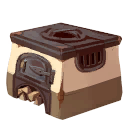

# Cooking Stations 

All the cooking stations & how to start a recipe explained.    

Below are the six cooking stations the game has.  
  
To cook ALL recipes available you will need 2 stations of each in your house.  
Some recipes are started at the same station that you also need for your ingredients.   
So, for example, some dishes started on a stove, like Chili Oil Dumpings, also need rice to be cooked on a stove.   
You'd need a second stove to cook the rice on.  
I will explain more about how you can see what you need below.

| Image | Name | Usage | How to Obtain  | 
|:-----:|------|--------|-------------|
|| Campfire | Only used for smaller dishes that have 1 ingredient and cannot be cooked together. This is also where you make the **Fisherman's Brew** to help with your fishing adventures. | Craftable at your Workstation for:   5 Sapwood - 10 Stone - 2 Flint - 10 Plant Fiber |
|| Grill Master v3000 | Just an upgrade for the Campfire above, it can cook the same recipes. It is however a one of a kind quest item. | **The GrillMaster** is obtained by the Player during the quest **It Must Flow** and cannot be crafted. **It Must Flow** is a **Found Item Quest** started by interacting with an empty spice rack in the kitchen of Hodari and Najuma's House. |
|| Standard Stove | Very recognizable work station. | Craftable at your Workstation for:  12 Stone - Brick 5 Ceramic - 2 Copper Bar |
|| Mixing Station | Can be regognized by the linnen cloth on top.  | Craftable at your Workstation for:  20 Sapwood Plank-  2 Copper Bar - 3 Fabric |
|| Prep Station | Can be recognized by the scratches on top. | Craftable at your Workstation for:  16 Sapwood Plank - 2 Copper Bar - 6 Ceramic  |
|| Standard Oven | Very recognizable work station.   | Craftable at your Workstation for:  12 Stone Brick - 7 Ceramic - 4 Copper Bar  | 

      

