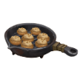
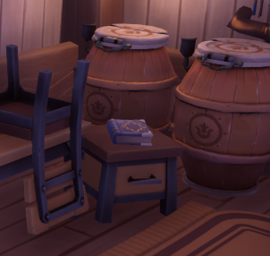

# Cooking Recipes

Below are all known **Recipes** with images and how to obtain them, how much focus and  XP  they give and for how much you can sell the dish.

| Image | Name | Focus  | Cooking  XP  | How to Obtain | Location |
|-------|------------|------------:|------------|-------------|------------|
| | Akwinduu Chapaa | 250    375|  XP  | Obtained by the quest **Lost in the Wind**. Which is a **Found Item Quest** started by reading a **Recipe Scrap** near the **Statue Garden in Bahari Bay**. |  |
||Apple Pie| 325    487|  XP  |The recipe can be obtained by reaching **Friendship level 3 with Delaila**. And completing either the quest **Fertile Ground** or **Berry Blues.**|
||Bacon-Stuffed Mushrooms| 255    337| XP |The recipe is found on a small table in the kitchen of the **Daiya Family's House**. | |
||Bean Burger | 800    1200| XP | The recipe can be obtained by looting a **treasure chest** that can be found hidden inside the mysterious cave during the quest **Like A Shiprunt.** The chest is located behind Ulfe.|
||Blueberry Pie| 225    337| XP |The recipe can be purchased from the Reth / Cooking Guild Store upon reaching Cooking Cooking Level 6, for  1,500 Gold.|
