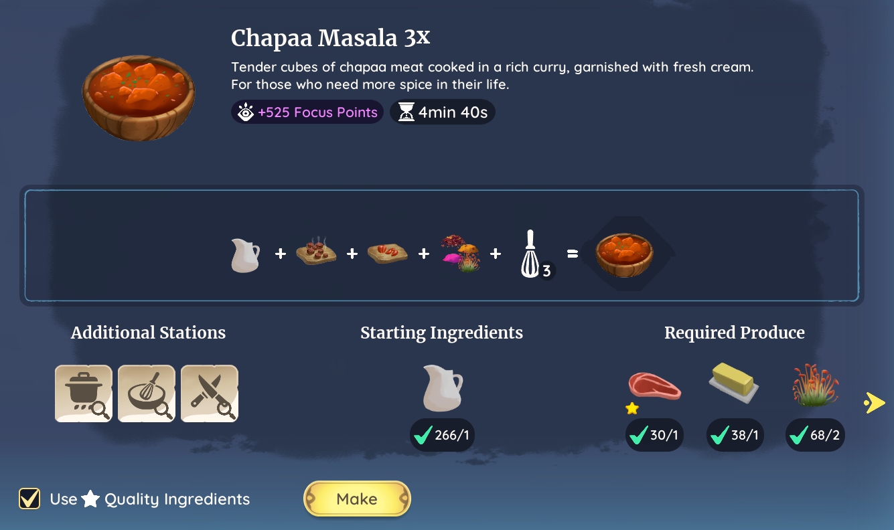
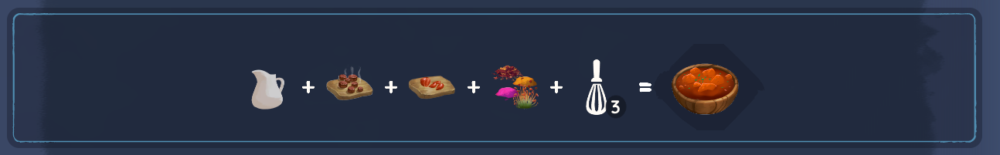
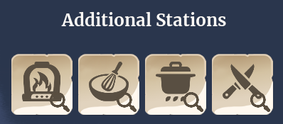
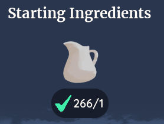
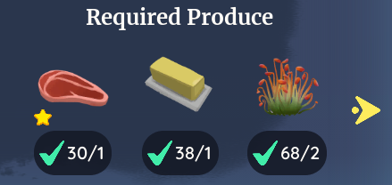
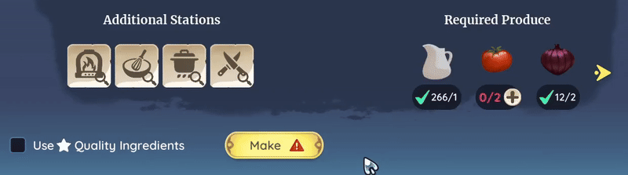

# Start cooking!
  
🍳To start a recipe you simple interact with one of the stations and choose your recipe.  
You will see:  
The dish, the steps, additional stations, starting ingredients📌, & required produce.   
(📌Some recipes do not have **starting ingredients**)       

   
   
## 🍳**The steps**🍳 
The steps show how long or complicated a recipe is, the more steps, the more time you get, but they're also harder to complete on your own.    

   

## 🍳**Aditional Stations**🍳 
The additional stations show which stations you need in addition to the one you start the recipe.  
The icons represent the different stations.  
From left to right;  
Standard Oven, Mixing Station, Standard Stove, Prep Station.  
| |
|:-:|
| |
|     |

   
 
## 🍳**Starting Ingredients**🍳 
This simply shows wich ingredients are needed to start a recipe, without these you cannot start the recipe.  
Some recipes, like the Bean Burger, don't require an ingredient to start the recipe.  
     

## 🍳**Required Produce**🍳 
This shows you wich produce and other ingredients you need to complete the recipe.  
If you're cooking alone, then you DO have to have all ingredients. 
You do not have to have all ingredients yourself, if a friend can step in and add the missing ingredient you both get the dishes!!     
     

You can also use starred ingredients, but you need to enable this **before** you start the recipe. 
This allows you to use starred ingredients, but does not limit the use of unstarred ingredients. 
Without this option enabled your starred ingredients will not be taken.   
.

