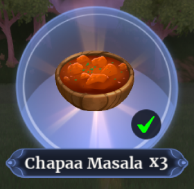
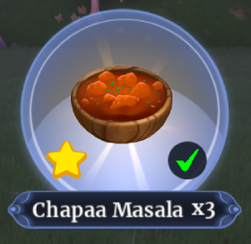
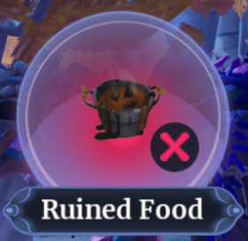
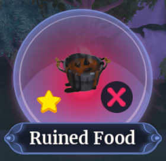
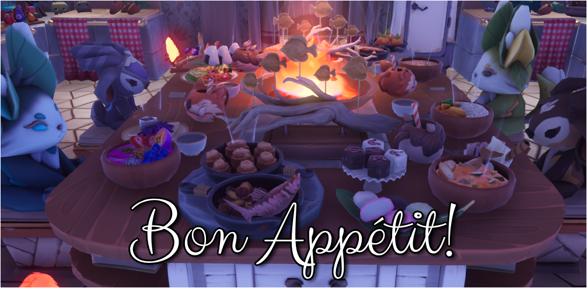

# Start cooking!
  
🍳To start a recipe you simple interact with one of the stations and choose your recipe.  
You will see:  
The dish, the steps, additional stations, starting ingredients📌, & required produce.   
(📌Some recipes do not have **starting ingredients** )       

   
   
## 🍳**The steps**🍳 
The steps show how long or complicated a recipe is, the more steps, the more time you get, but they're also harder to complete on your own.    

   

## 🍳**Aditional Stations**🍳 
The additional stations show which stations you need in addition to the one you start the recipe.  
The icons represent the different stations.  
From left to right;  
Standard Oven, Mixing Station, Standard Stove, Prep Station.  
| |
|:-:|
| |
|     |

   
 
## 🍳**Starting Ingredients**🍳 
This simply shows wich ingredients are needed to start a recipe, without these you cannot start the recipe.  
Some recipes, like the Bean Burger, don't require an ingredient to start the recipe.  
     

**## 🍳**Required Produce**🍳 **
This shows you wich produce and other ingredients you need to complete the recipe.  
If you're cooking alone, then you DO have to have all ingredients. 
You do not have to have all ingredients yourself, if a friend can step in and add the missing ingredient you both get the dishes!!     
     

You can also use starred ingredients, but you need to enable this **before** you start the recipe. 
This allows you to use starred ingredients, but does not limit the use of unstarred ingredients. 
Without this option enabled your starred ingredients will not be taken.   
When you're ready to cook, press "MAKE".    
    

## 🍳**Cooking the dish**🍳 
After you've pressed "MAKE" you will presented with a lot of icons above the cooking stations. 
Each indicating which ingredient or produce you need to prepare.  
It will look like this;    
   

### 🎮**The minigames**🎮
When you interact with a cooking station you can choose which ingredient you wish you prepare.    
    
And when you pick an ingredient to prepare you will be presented with a minigame.
| Chopping | Flipping  | Mixing |
|:-:|:-:|:-:|
| You need to click (Or press X / A) to chop when the blue bar is in the white bar. | You need to **click and hold** (Or press X / A) and release once the the blue circle is in the white circle | Simply click and hold (Or press X / A) to mix. |
||||
 
The hand and the check mark mean the ingredient is ready, the people icon means that someone is busy preparing.    

 

And all ingredients that are ready to add to your dish are shown at the bottom of your screen aswell.   

Make sure you pay attention to the station you started on! Sometimes you need to stir the dish in between preparing the ingredients.  

## ✅**Finishing a dish**✅

Use the cooking station you started at to add all ingredients and your dish is ready!! 
And if everything went well, you will have your dish ready to collect.  
Using  starred ingredients will increse the chance of a  starred dish!  
But if things went slighty wrong you might be presented with Ruined Food.  
| Un-starred Food |  Starred Food  | 
|:-:|:-:|
| Non-starred food will give less focus on consumption  and will have a lower gold value. |  Starred Food gives more focus and has a higher gold value.    And can be placed in and around your house as decoration! |
| |  |
| **Un-starred Ruined Food** |  **Starred Ruined Food**  | 
| Non-starred ruined food is a junk item   and can be sold for  5 Gold. |  Starred Ruined Food is still classified as junk, it sells for  7 Gold.     But it can also be placed in and around your house as decoration! |
|  |  |

## 💰**Gold Value**💰
Prices of the same dish might vary a lot, it depends on the value of the ingredients, the meat, the difference between Heat Root or Dari Cloves, the value of your fish.  
The higher the value of the ingredients, the higher the value of your dish.  
And cooking with friends divides the initial cost of ingredients per person.  
That's why cooking with friends or in one of our events is great to gain some money or a lot of focus food!!  
**See you soon!**   
  
