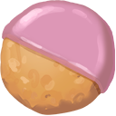
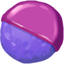
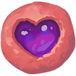
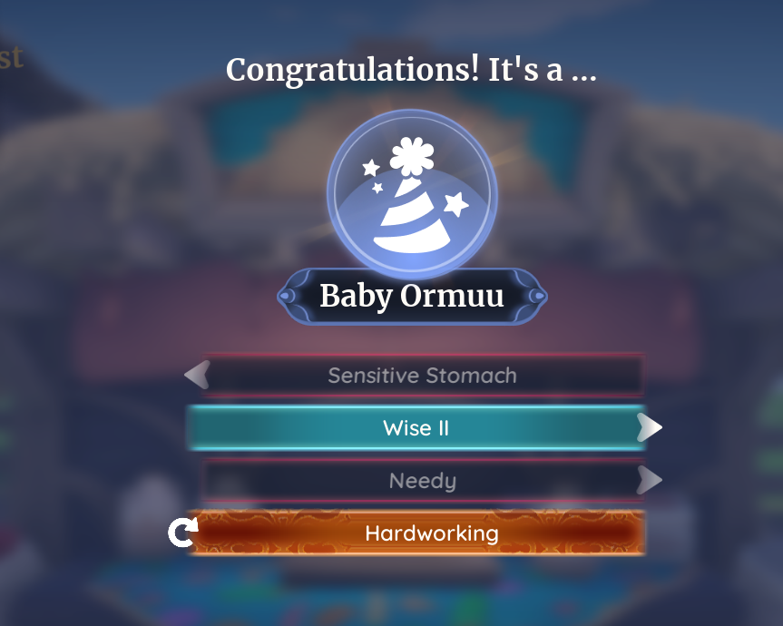

# Advanced Breeding

Below you will find all information gathered within the **community and external sources combined**.

Advanced Breeding focuses on techniques to **target specific traits or trait combinations** for your animals.

---

## 🥠 Technique 1: Trait Reset & Targeting
This method is used when an animal already has unwanted traits, and you want to force a **specific trait outcome**.  

### Steps:
1. **Reset Traits**  
   - Use an **Oopsie Cookie** on the animal.  
   
   
   
   - Use this to remove all traits currently on the animal, leaving it “blank.”  

2. **Apply a Trait Treat**  
   - Feed the animal a **Trait Treat** to assign a new trait.  
   
   
   
   
   - Repeat Step 1 and 2 until the animal belongs to the **correct Trait Group** ur targeting (see **Functional Traits** page for grouping details).  

4. **Refine with Reroll Cookie**  
   - Once the animal is in the correct Trait Group, use a **Reroll Cookie**.
   
   
   
   - This will shuffle traits within that group until the **desired trait** appears.

:::caution

   Sometimes, this might swap **Trait Group** as some traits have a **shared group** and so swaps to another group. This is where u have to restart again.

:::

---

## 🎯 Why Use This Method?
- Guarantees the animal is **locked into the right group** before targeting.  
- Reduces wasted attempts on traits outside of the group you want.  
- Makes breeding for **rare or high-value traits** much more efficient.  

---

## ⚠️ Tips & Notes
- This method can be **resource-intensive** (multiple cookies & treats).  
- Always double-check the **Trait Group** before investing more items.

---

## 🧬 Technique 2: Triple Breeding Method
This method uses **three animals of the same species** to increase your chances of producing an offspring with the **desired trait combination**.  

:::tip Tasty Trait

One of the three animal can have a **Tasty Trait**, you can reroll them also just like **Technique 1**

:::

### Steps:
1. **Prepare Three Animals**  
   - Obtain **3 animals of the same species**.  
   - Ideally, each should already have useful or compatible traits (following **Technique 1: Trait Reset & Targeting**, you could end up with 3 different animals with **1 prefered trait**).  

2. **Breed Strategically**  
   - Breed the 1st and 2nd animals → keep the baby if it shows the desired trait(s).  
   - If not, try again with a **Go_Next_Cookie**.

   
   
   - Repeat as necessary until the offspring has **2 target trait combination**.

3. **Final Combination**  
   - Ensure that you have the offspring with the **targeted trait combination**.  
   - Breed the **Offspring animal** with the **3th animal**.  

---

## 🎯 Why Use This Method?
- Gives you a **larger trait pool** to work with instead of relying on just 2 parents.  
- Allows you to **cross-check offspring** between different pairs.  
- More efficient for stacking **multiple traits** into a single animal over generations.  

---

## ⚠️ Tips & Notes
- This technique is slower than simple breeding but **far more reliable** for rare traits.  
- Always keep backups of your “founder animals” so you don’t lose progress.  
- Works best when you already know which **Trait Group** you’re targeting.  

---

## 🧪 Technique 3: Mutation Traits
Mutation Traits are **special outcomes** that occur when two parents each carry a different ingredient trait.  
When combined through breeding, these traits can **mutate into a completely new trait** in the offspring.  

---

### Mutation Table

| Ingredient 1        | Ingredient 2         | Result        |
|---------------------|----------------------|---------------|
| Malcontent          | Hangry               | Clingy        |
| Beepressed          | Sensitive Stomach    | Content VI    |
| Grumpy              | Sensitive Stomach    | Content VI    |
| Grumpy              | Overstimulated       | Content VI    |
| Soft I              | Sensitive Stomach    | Good Memory   |
| Soft II             | Sensitive Stomach    | Good Memory   |
| Cuddly              | Fast Metabolism I    | Happy Medium  |
| Sensitive Stomach   | Needy                | Hardworking   |
| Cuddly              | Sensitive Stomach    | Healthy       |
| Malcontent          | Fast Metabolism I    | Healthy       |
| Malcontent          | Fast Metabolism II   | Healthy       |
| Needy               | Hangry               | Healthy       |
| Beepressed          | Needy                | Mild          |
| Needy               | Grumpy               | Mild          |
| Needy               | Fast Metabolism I    | Mild          |
| Needy               | Fast Metabolism II   | Mild          |
| Sensitive Stomach   | Fast Metabolism I    | Mild          |
| Sensitive Stomach   | Fast Metabolism II   | Mild          |
| Beepressed          | Cuddly               | Motivated     |
| Grumpy              | Cuddly               | Motivated     |
| Sensitive Stomach   | Hangry               | Snacky        |
| Cheerful I          | Malcontent           | Well-Loved I  |
| Content II          | Cheerful II          | Well-Loved II |
| Content III         | Cheerful III         | Well-Loved III|
| Content IV          | Cheerful IV          | Well-Loved IV |
| Content V           | Cheerful V           | Well-Loved V  |
| Beepressed          | Malcontent           | Well-Loved VI |
| Malcontent          | Grumpy               | Well-Loved VI |

### 🔄 How It Works
1. **Assign Parent Traits**  
   - Parent A must have a trait from **Ingredient 1**.  
   - Parent B must have a trait from **Ingredient 2**.  

2. **Breed the Parents**  
   - During breeding, the game checks for possible **mutation recipes**.  
   - If the Ingredient 1 + Ingredient 2 combination exists, the offspring may inherit the **mutation result** instead of the original traits.  

3. **Mutation Result**  
   - The baby receives the **new mutation trait**, replacing the two ingredient traits.
   
   

---

### 📖 Example
From the mutation recipes:  

- If Parent A has **Malcontent** and Parent B has **Hangry**, the offspring may mutate into **Clingy**.  
- If Parent A has **Grumpy** and Parent B has **Overstimulated**, the offspring may mutate into **Content VI**.  

---

### 🎯 Why Use Mutation Traits?
- Unlocks **new traits** not directly obtainable through normal breeding.  
- Allows breeders to **target rare and powerful traits** using known recipes.  
- Adds depth and strategy by mixing traits across generations.  

---

### ⚠️ Tips & Notes
- Mutations are **not guaranteed** — they may require multiple attempts.  
- Only specific combinations (see **Mutation Table**) will result in a mutation.  
- Best used once you have a **stable breeding line** and are hunting for rare traits.  

---

