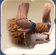
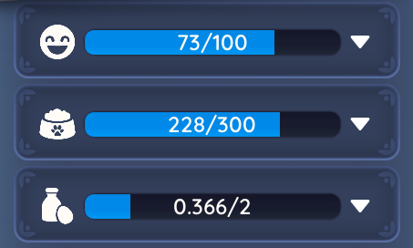

# Intro in Ranching

Welcome to the **Ranching Guide** for *Palia*! 🐄🐑🐇  

Ranching lets you raise, care for, and breed animals to produce valuable resources.  
This section of the guide will walk you through:  

- 🐾 Basics of ranching (getting started, breeding, advanced breeding)  
- 🍎 Leveling guide for ranching  
- 🐣 Breeding details and requirements  
- 📊 Reference tables for functional/cosmetic traits and different treats

--

## Ranch Animals

Here’s an overview of the current ranch animals:

| Peki      | Trufflet       | Ormuu   | Bee          |
|--------------|--------------|--------------|--------------|
|  |  |  |  |

--

## Ranching Levels & EXP

This table shows the **experience points (EXP)** required to level up ranching.  

| Level      | EXP Needed | Total EXP |
|------------|------------|-----------|
| 1 → 2      | 240        | 240       |
| 2 → 3      | 440        | 680       |
| 3 → 4      | 720        | 1,400     |
| 4 → 5      | 1,080      | 2,480     |
| 5 → 6      | 1,560      | 4,040     |
| 6 → 7      | 2,130      | 6,170     |
| 7 → 8      | 2,830      | 9,000     |
| 8 → 9      | 3,720      | 12,720    |
| 9 → 10     | 5,000      | 17,720    |
| 10+        | 5,000      | 22,720    |

---

# 🐾 Animal Attributes

Each animal in your ranch has **three two attributes** you need to manage.  
Keeping these bars filled is essential for **production, happiness, and efficiency**.

---

## 😀 Happiness
- Animals require a certain amount of **Happiness** to produce items.  
- Happiness increases when animals are:  
  - Fed regularly   
  - Given attention (interactions, petting, etc.)  
- If Happiness is too low, the animal **stops producing** until it improves.  

---

## 🍽️ Focus / Hunger
- Represents the animal’s **energy and nourishment**.  
- Feeding restores this bar.  
- If the bar runs out:  
  - Happiness decreases over time.  
  - Production rate slows or stops.  
- Some traits (like **Healthy Eater**) make this bar more effective for gaining **Ranching XP**.  

---

## 🥛 Production Storage
- Each interval of 1, the animal produces items (milk, eggs, mushrooms, etc.) **which are collectable**.  
- The bar fills as production accumulates.  
- Once full, production stops until you **collect the stored items**.  
- Regularly harvesting ensures animals **keep producing**.  

---

# ✨ Abilities

Each animal species has **one Ability** that determine what they produce in your ranch.  
Abilities are unique to the species and sometimes to the individual animal.

(Each species has a legendary trait that can modify what they produce) 

---

## 🐾 What Are Abilities?
- Abilities define the **type of product** an animal generates.  
- Example:  
  - `Mushroom Forager` → Produces mushrooms over time.  
  - Other animals may produce milk, eggs, honey, or rarer items.  
- Production fills the **Production Storage bar** and must be collected regularly.  

---

# ⚡ Status Effects

Animals can gain **temporary status effects** that act as buffs or debuffs.  
These effects are usually tied to items, traits, or environmental factors, and are measured in **hours**.  

---

## 🧩 What Are Status Effects?
- **Buffs** improve animal performance (e.g., faster production, more happiness gain, ect).  
- **Debuffs** reduce effectiveness (e.g., slower production, faster hunger drain, not be able to donate, ect).  

---

## 🍪 Example

- **PalSnax™ Premium** → A premium buff that improves an animal’s production efficiency.

---
