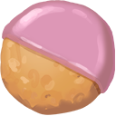

# Animal Treats

Below are all known **animal treats** with images and effects, ordered by **rarity**.

:::tip How to obtain

Treats can be obtained by a treat bag with the noted **Rarity**

:::

| Image | Treat Name | Treat Type | Rarity | Purchasable | Effect |
|-------|------------|------------|--------|-------------|--------|
|  | Bad Breed Biscuit | Anti-Passdown Trait | Common | Buy with Gold | Moderately reduces the likelihood of your animals traits to be passed down the next time its bred. |
|  | Fancy Breed Biscuit | Passdown Trait | Common | Buy with Gold | Allows your animal to pass on up to three traits to its offspring when breeding. |
|  | Fast-Grow Cookie | Aging | Common | Buy with Gold | Significantly increases the rate at which your animal ages. |
|  | Feel Good Cookie | Instant Happiness | Common |  | Grants a slight amount of happiness |
|  | Me-First Cookie | Passdown Trait | Common | Buy with Gold | Ensures that your animals traits have priority for inheritance when breeding. |
|  | PalSnax™ | Production Gain | Common |  | Slightly increases how quickly your animals production bar fills a single time. |
|  | Plain Cookie | Cookie Reset | Common | Buy with Gold | Removes any current cookie effect from the animal |
|  | Tasty Treat | Happiness Gain | Common |  | Slightly increases your animals happiness gain the next time you feed it. |
|  | Cookie of the Day | Traits | Uncommon | Buy with Guild Coins | Feed this to an animal to grant it a single random Cosmetic trait |
|  | Fancier Breed Biscuit | Passdown Trait | Uncommon | Buy with Guild Coins | Allows your animal to pass on up to four traits to its offspring when breeding. |
|  | Faster-Grow Cookie | Aging | Uncommon | Buy with Guild Coins | Greatly increases the rate at which your animal ages. |
|  | Feel Great Cookie | Instant Happiness | Uncommon |  | Grants a moderate amount of happiness. |
|  | Good Value Biscuit | Donation Value | Uncommon |  | Slightly increases the donation value of your animal. |
|  | Namewell Cookie | Name Changing | Uncommon | Buy with Gold | Lets you rename your animal |
|  | PalSnax™ Plus | Production Gain | Uncommon |  | Moderately increases how quickly your animals production bar fills a single time. |
|  | Predictable Cookie | Anti-Traits | Uncommon | Buy with Gold | Blocks your animal from randomly gaining new traits. |
|  | Roulette Cookie | Traits | Uncommon | Buy with Guild Coins | Feed this to an animal to grant it a single random trait. |
|  | Trait Treat | Traits | Uncommon | Buy with Guild Coins | Feed this to an animal to grant it a single random Functional trait. |
|  | Very Tasty Treat | Happiness Gain | Uncommon |  | Moderately increases your animals happiness gain the next time you feed it. |
|  | Worse Breed Biscuit | Anti-Passdown Trait | Uncommon | Buy with Guild Coins | Significantly reduces the likelihood of your animals traits to be passed down the next time its bred. |
|  | Extremely Tasty Treat | Happiness Gain | Rare |  | Greatly increases your animals happiness gain the next time you feed it. |
|  | Fanciest Breed Biscuit | Passdown Trait | Rare |  | Allows your animal to pass on up to five traits to its offspring when breeding. |
|  | Fastest-Grow Cookie | Aging | Rare |  | Massively increases the rate at which your animal ages. |
|  | Feel Amazing Cookie | Instant Happiness | Rare |  | Grants a great amount of happiness. |
|  | Go Next Cookie | Breeding Reset | Rare |  | Clears the breeding cooldown from  your animal. |
|  | Great Value Biscuit | Donation Value | Rare |  | Moderately increases the donation value of your animal. |
|  | Insta-Grow Cookie | Aging | Rare |  | Instantly ages your animal to the next life stage (Baby -> Young Adult -> Adult....) |
|  | Never-Grow Cookie | Anti-Aging | Rare | Buy with Gold | When fed to a baby animal, prevents them from growing to the next life stage. |
|  | Oopsie Cookie | Traits | Rare | Buy with Gold | Feed this to an animal to remove a single random trait. |
|  | PalSnax™ Ultra | Production Gain | Rare |  | Significantly increases how quickly your animals production bar fills a single time. |
|  | Worst Breed Biscuit | Anti-Passdown Trait | Rare |  | Greatly reduces the likelihood of your animals traits to be passed down the next time its bred. |
|  | Best Value Biscuit | Donation Value | Epic |  | Significantly increases the donation value of your animal |
|  | PalSnax™ Premium | Production Gain | Epic |  | Greatly increases how quickly your animals production bar fills a single time. |
|  | Reroll Cookie | Traits | Epic | Buy with Guild Coins | Randomizes the tier/type of each of your animals traits. |
|  | Tasty Trait Treat | Traits | Epic | Buy with Guild Coins | Adds a random functional trait to your animal that scales with the number of cosmetic traits it has. |
|  | The Tastiest Treat | Happiness Gain | Epic |  | Massively increases your animals happiness gain the next time you feed it. |
|  | Divine Doughnut | Youthful | Legendary |  | Allows a venerable animal to become a baby again, while maintaining all of its traits. |
|  | Immaculate Confection | Breeding | Legendary |  | Creates a baby using your animal as the singular parent. |

