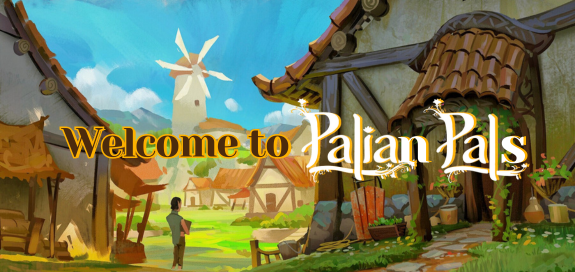

#Guidelines

  

# 🌿 Welcome, Villager! 🌿

We’re so glad you’ve found your way to our little corner of the world.

Whether you’re just starting in Palia or already a seasoned adventurer, this server is **your new home base: a place to connect, share stories, and build lasting friendships with fellow Palian Pals.** 💚

Here, you’ll find cozy chats, helpful guides, exciting events, and neighbors who are always ready to lend a hand. 

From learning where to find glow worms, to celebrating big milestones together, our community thrives on kindness, respect, and a shared love for the world of Palia. 🏡✨

So settle in, explore the channels, and don’t be shy to introduce yourself because we’d love to meet you!

Also, to help us get-to-know you more, react which country you are from.
**Together, let’s make this community a place where every voice feels heard and every story matters.**

---

  

# 🌟 Palian Pals Community Rules 🌟

### 🌿 Use Your In-Game Name (IGN)
 - Your server nickname **must match your Palia in-game name**.
 - **DO NOT** add emoji **before your server profile name** as it is only implemented for the staff
 - You can add emoji **after your ign** if you like.
 - This helps us identify each other easily during events, trades, and collaborations.

### 💚 Kindness Above All
 - Treat every member with respect and decency.
 - **Harassment, bullying, discrimination, hate speech, or toxic behavior** of any kind will not be tolerated.
 - Disagreements are natural, but resolve them calmly, NO insults, NO grudges.

### 👥 Respect the Staff & Follow Event Guidelines
 - During events, **listen to moderators and hosts**.
 - Follow instructions promptly to keep events fair, organized, and enjoyable.
 - Disrupting or ignoring staff guidance may result in a strike or, in the worst case, removal from activities or the server.

### 🧭 Stay on Topic in Channels
 - Each channel serves a purpose to **keep discussions relevant**.
 - Off-topic posts should be directed at the designated channels.
 - Read each channel’s description before posting.

### 📵 No Self-Promotion, Spam, or Unauthorized Streams
 - Do not advertise external servers, products, or content without prior staff approval.

    - Avoid excessive reposts, chain messages, or disruptive spam.
    - **Live streaming or event coverage requires explicit permission** from staff or hosts. 

        Once caught doing so, you will receive an **AUTOMATIC STRIKE worth 2 points** and may be reprimanded by the staff or moderators.

### 🚫 No Sensitive or Inappropriate Topics
 - NSFW content, explicit language, political/religious debates, and other sensitive discussions are strictly forbidden.

    This is a **safe space for all ages**. ALWAYS keep conversations clean and welcoming.

### 🏡 Be a Helpful Neighbor
 - Assist fellow members whenever possible, whether it’s answering questions, giving tips, or sharing resources.

    **Remember**: We were all beginners once. A little patience and kindness go a long way.

### ⚠️ Spoiler Control
 - If discussing storylines, quests, or unreleased content, use **spoiler tags**.
 - Respect those who want to discover Palia at their own pace.

### 🎙️ Voice Chat Etiquette
 - When attending events: Use push-to-talk if your background is noisy.
 - Do not shout, stop the music (especially if the host is using it), or disrupt conversations.
 - Respect ongoing discussions; avoid talking over others, wait for your turn to speak.

### 🌐 Language & Communication
 - English is the primary language of this server to keep discussions accessible to all members.

    Avoid excessive use of slang, **ALL CAPS**, or unreadable text. Clear communication keeps the community strong.

### 🔒 Respect Privacy
 - **DO NOT PRIVATE MESSAGE the staff** unless it is urgent. Be patient for their replies, as everyone is busy managing the server and attending to real-life duties. 

 - **RESPECT THEIR PRIVACY** at all times.

    - Do not share personal information (yours or others’) publicly.

    - Screenshots, DMs, or private conversations **cannot be posted without consent**.

    - Violating privacy rules may lead to a strike or, in the worst case, immediate removal.

### 🚨 Report, Don’t Escalate
 - If you encounter a rule-breaker, **submit a ticket or report it directly to staff**.
Do not argue, attack, or “fight back.” Let moderators handle it.

### ✅ Final Note: 
- By being here, you agree to follow these rules and uphold the cozy, respectful spirit of the Palian Pals community.

    **Together**, let’s create a safe haven where everyone feels welcome, one cozy chat at a time. 🌱
