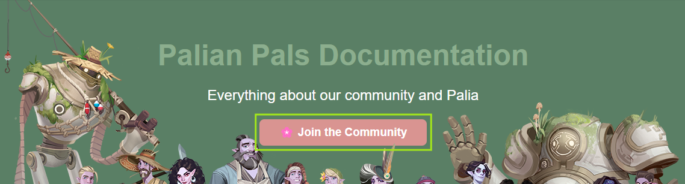
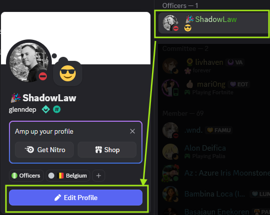
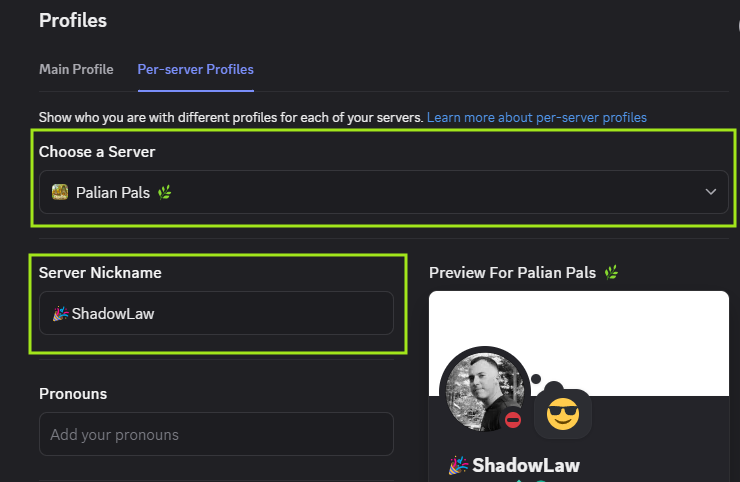

# How to Join
Joining the **Palian Pals community** is simple! Follow these steps carefully to get started.

---

## 1. Find the Join Button

You can click **either of the join buttons** below to start your request:  

  
  

*Click any "Join" button to procceed to next step*

---

## 2. Confirm Your Request

After clicking join, you will be prompted to **complete the screening form**.  
Make sure to answer all required questions honestly — this helps our moderators approve your membership.  

> ⚠️ **Note:** Membership approval may take some time as our moderators verify new members.  
> Please be patient — this ensures a safe and welcoming community for everyone.

---

## 3. Set Your Server Name

Once your request is accepted:  

1. Open the Discord server.  
2. Click on your **profile in the server** (right-click or tap your name).  
3. Select **Edit Server Profile**. 
4. Change your **server nickname** to match your **Palia in-game name (IGN)**.

---

  
  

This helps everyone recognize you in the community and keeps our space organized and friendly! 🌿

---

Welcome aboard! You’re now a part of **Palian Pals** — start exploring, participating in events, and making friends.
